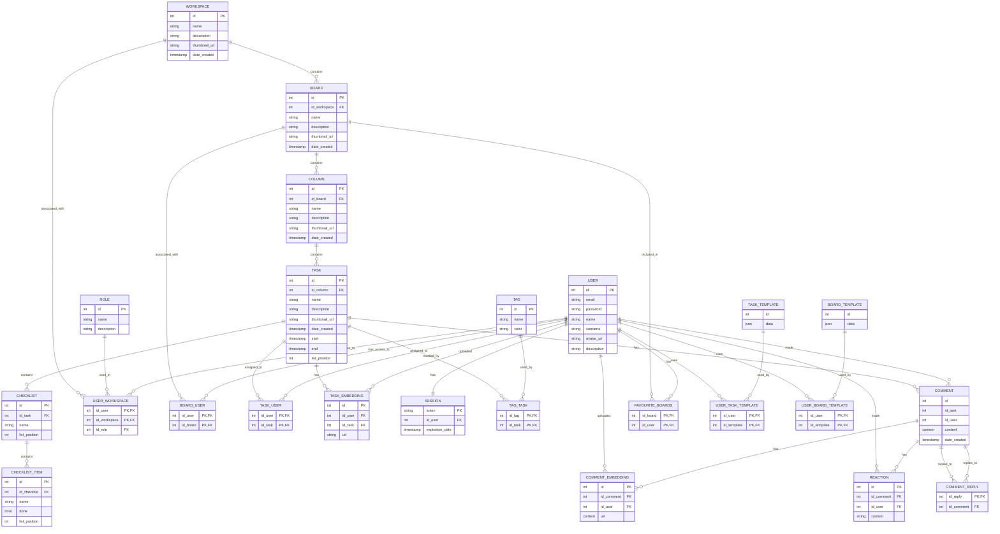

# Функциональные зависимости

## Таблица Workspace:
    {Workspace.id} -> Workspace.id
    {Workspace.id} -> Workspace.name
    {Workspace.id} -> Workspace.thumbnail_url
    {Workspace.id} -> Workspace.date_created
    {Workspace.id} -> Workspace.description

## Role User-a по его id и связанному Workspace-у:
    {User.id, Workspace.id} -> Role.id

## Таблица Board:
    {Board.id} -> Board.id
    {Board.id} -> Board.name
    {Board.id} -> Board.description
    {Board.id} -> Board.date_created
    {Board.id} -> Board.thumbnail_url

## Принадлежание Board к одному Workspace-у:
    {Board.id} -> Workspace.id

## Таблица Column:
    {Column.id} -> Column.id
    {Column.id} -> Column.name
    {Column.id} -> Column.description
    {Column.id} -> Column.list_position

## Принадлежание Column к одному Board-у:
    {Column.id} -> Board.id

## Таблица Role:
    {Role.id} -> Role.id
    {Role.id} -> Role.name
    {Role.id} -> Role.description

## Таблица Task:
    {Task.id} -> Task.id
    {Task.id} -> Task.name
    {Task.id} -> Task.date_created
    {Task.id} -> Task.description
    {Task.id} -> Task.start
    {Task.id} -> Task.end
    {Task.id} -> Task.list_position

## Принадлежание Task к одному Column-у:
    {Task.id} -> Column.id

## Таблица Tag:
    {Tag.id} -> Tag.id
    {Tag.id} -> Tag.name
    {Tag.id} -> Tag.color

## Связь Tag и Task:
    {Tag.id, Task.id} -> Tag.id
    {Tag.id, Task.id} -> Tag.name
    {Tag.id, Task.id} -> Tag.color
    {Tag.id, Task.id} -> Task.id
    {Tag.id, Task.id} -> Task.name
    {Tag.id, Task.id} -> Task.date_created
    {Tag.id, Task.id} -> Task.description
    {Tag.id, Task.id} -> Task.start
    {Tag.id, Task.id} -> Task.end
    {Tag.id, Task.id} -> Task.list_position

## Таблица User:
    {User.id} -> User.id
    {User.id} -> User.email
    {User.id} -> User.password_hash
    {User.id} -> User.name
    {User.id} -> User.surname
    {User.id} -> User.avatar_url
    {User.id} -> User.description
    
## Любимые Board-ы User-а:
    {Board.id User.id} -> User.id
    {Board.id User.id} -> User.email
    {Board.id User.id} -> User.password_hash
    {Board.id User.id} -> User.name
    {Board.id User.id} -> User.surname
    {Board.id User.id} -> User.avatar_url
    {Board.id User.id} -> User.description
    {Board.id User.id} -> Board.id
    {Board.id User.id} -> Board.name
    {Board.id User.id} -> Board.description
    {Board.id User.id} -> Board.date_created
    {Board.id User.id} -> Board.thumbnail_url

## Связь Board и User:
    {User.id, Board.id} -> User.id
    {User.id, Board.id} -> User.email
    {User.id, Board.id} -> User.password_hash
    {User.id, Board.id} -> User.name
    {User.id, Board.id} -> User.surname
    {User.id, Board.id} -> User.avatar_url
    {User.id, Board.id} -> User.description
    {User.id, Board.id} -> Board.id
    {User.id, Board.id} -> Board.name
    {User.id, Board.id} -> Board.description
    {User.id, Board.id} -> Board.date_created
    {User.id, Board.id} -> Board.thumbnail_url

## Таблица Task_Template:
    {Task_Template.id} -> Task_Template.id
    {Task_Template.id} -> Task_Template.data

## Связь Task_Template и User-а:
    {User.id, Task_Template.id} -> User.id
    {User.id, Task_Template.id} -> User.email
    {User.id, Task_Template.id} -> User.password_hash
    {User.id, Task_Template.id} -> User.name
    {User.id, Task_Template.id} -> User.surname
    {User.id, Task_Template.id} -> User.avatar_url
    {User.id, Task_Template.id} -> User.description
    {User.id, Task_Template.id} -> Task_Template.id
    {User.id, Task_Template.id} -> Task_Template.data

## Таблица Board_Template:
    {Board_template.id} -> Board_template.id
    {Board_template.id} -> Board_template.data

## Таблица Board_Template:
    {User.id, Board_template.id} -> User.id
    {User.id, Board_template.id} -> User.email
    {User.id, Board_template.id} -> User.password_hash
    {User.id, Board_template.id} -> User.name
    {User.id, Board_template.id} -> User.surname
    {User.id, Board_template.id} -> User.avatar_url
    {User.id, Board_template.id} -> User.description
    {User.id, Board_template.id} -> Board_template.id
    {User.id, Board_template.id} -> Board_template.data

## Таблица Checklist:
    {Checklist.id} -> Checklist.id
    {Checklist.id} -> Checklist.name
    {Checklist.id} -> Checklist.list_position

## Принадлежание Checklist к одному Task-у:
    {Checklist.id} -> Task.id

## Таблица Checklist_Item:
    {Checklist_item.id} -> Checklist_item.id
    {Checklist_item.id} -> Checklist_item.name
    {Checklist_item.id} -> Checklist_item.done
    {Checklist_item.id} -> Checklist_item.list_position

## Принадлежание Checklist_Item к одному Checklist-у:
    {Checklist_item.id} -> Checklist.id

## User, которому доверен Task:
    {User.id, Task.id} -> User.id
    {User.id, Task.id} -> User.id
    {User.id, Task.id} -> User.email
    {User.id, Task.id} -> User.password_hash
    {User.id, Task.id} -> User.name
    {User.id, Task.id} -> User.surname
    {User.id, Task.id} -> User.avatar_url
    {User.id, Task.id} -> User.description
    {User.id, Task.id} -> Task.id
    {User.id, Task.id} -> Task.name
    {User.id, Task.id} -> Task.date_created
    {User.id, Task.id} -> Task.description
    {User.id, Task.id} -> Task.start
    {User.id, Task.id} -> Task.end
    {User.id, Task.id} -> Task.list_position

## Таблица Task_embedding:
    {Task_embedding.id} -> Task_embedding.id
    {Task_embedding.id} -> Task_embedding.url

## Принадлежание Task_embedding к одному Task-у:
    {Task_embedding.id} -> Task.id

## Принадлежание Task_embedding к одному User-у:
    {Task_embedding.id} -> User.id

## Таблица Session:
    {Session.token} -> Session.token
    {Session.token} -> Session.expiration_date

## Принадлежание Session к одному User-у:
    {Session.token} -> User.id

## Таблица Comment:
    {Comment.id} -> Comment.id
    {Comment.id} -> Comment.content
    {Comment.id} -> Comment.date_created

## Принадлежание Comment к одному User-у:
    {Comment.id} -> User.id

## Принадлежание Comment к одному Task-у:
    {Comment.id} -> Task.id

## Принадлежание Comment_Reply к одному Comment-у:
    {Comment_Reply.id} -> Comment.id

## Таблица Reaction:
    {Reaction.id} -> Reaction.id
    {Reaction.id} -> Reaction.content

## Принадлежание Reaction к одному User-у:
    {Reaction.id} -> User.id

## Принадлежание Reaction к одному Comment-у:
    {Reaction.id} -> Comment.id

## Таблица Comment_Embedding:
    {Comment_embedding.id} -> Comment_embedding.id
    {Comment_embedding.id} -> Comment_embedding.url

## Принадлежание Comment_Embedding к одному User-у:
    {Comment_embedding.id} -> User.id

## Принадлежание Comment_Embedding к одному Comment-у:
    {Comment_embedding.id} -> Comment.id

# Схема

