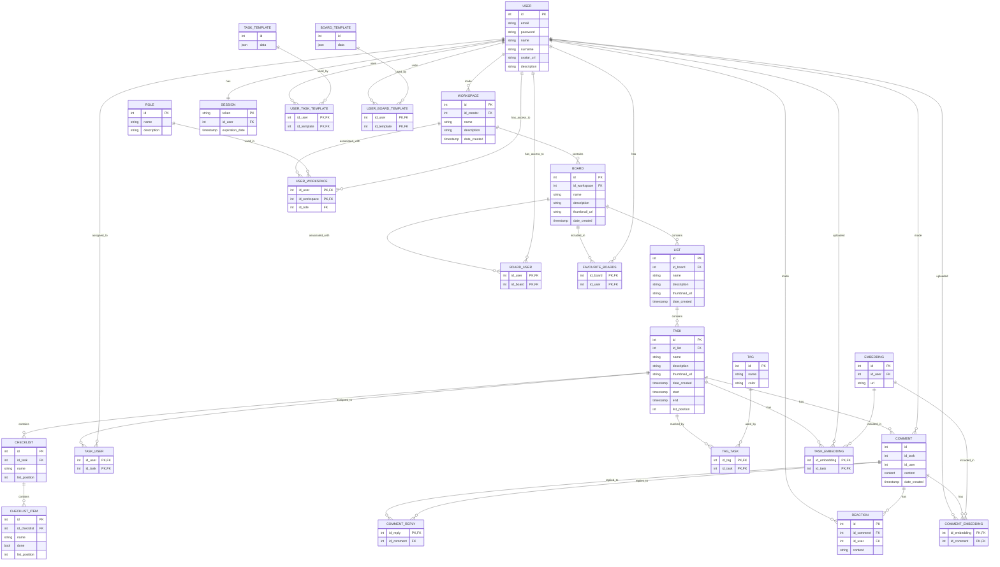

# Схема

# Описание таблиц

## workspace
Рабочее пространство, в котором хранятся доски.
    id    
    id_creator                     
    name                        
    thumbnail_url               
    date_created                
    description                 

## board
Доска Канбан, разделенная на столбцы.
    id                          
    id_workspace                
    name                        
    description                 
    date_created                
    thumbnail_url               

## list
Список в доске, в котором хранятся задания можно менять их порядок.
    id                          
    id_board                    
    name                        
    description                 
    list_position               

## role
Роль пользователя в рабочем пространстве.
    id                          
    name                        
    description                 

## task
Задание, ему можно добавить сроки и менять их порядок в столбце.
    id                          
    id_list                   
    name                        
    date_created                
    description                 
    start                       
    end                         
    list_position               

## tag
Тэги, которые можно добавить к заданиям и настроить их цвет в формате hex.
    id                          
    name                        
    color                       

## user
Пользователь сервиса, для работы достаточно указать почту и пароль, остальные поля опциональны, пароль хранится в виде хэша.
    id                          
    email                       
    password_hash               
    name                        
    surname                     
    avatar_url                  
    description                 

## task_template
Шаблоны для заданий, некоторые созданы разработчиками, пользователи могут создавать свои. Данные хранятся в формате json, т.к. это лучший способ хранить копии данных из таблицы task.
    id                          
    data                        

## board_template
Шаблоны для досок, некоторые созданы разработчиками, пользователи могут создавать свои. Данные хранятся в формате json, т.к. это лучший способ хранить копии данных из таблицы board.
    id                          
    data                        

## checklist
Список задач внутри задания, можно добавить несколько в одно задание и поменять их порядок.
    id                          
    id_task                     
    name                        
    list_position               

## checklist_item
Одна мини-задача в чек-листе, которую можно пометить как завершенную.
    id                          
    id_checklist                
    name                        
    done                        
    list_position               

## user_workspace
Связующая таблица отношения М2М между пользователем и рабочими пространствоми, также позволяет добавить пользователю его роли в них.
    id_user                     
    id_workspace                
    id_role                     

## board_user
Связующая таблица отношения М2М между пользователем и досками, к которым у него есть доступ.
    id_user                     
    id_board                    

## task_user
Связующая таблица отношения М2М между пользователем и порученным ему заданием.
    id_user                     
    id_task                     

## session
Текущая сессия пользователя, чтобы не нужно было вводить логин и пароль несколько раз.
    token                       
    id_user                     
    expiration_date             

## tag_task
Связующая таблица отношения М2М между тэгами и заданиями, помеченными ими.
    id_tag                      
    id_task                     

## comment
Комментарий к заданию, к которому можно прикрепить файл и на который можно ответить.
    id                          
    id_user                     
    id_task                     
    content                     
    date_created                

## comment_reply
Таблица с ссылками на ответы к комментариям, чтобы рекурсивно проходить по ним.
    id_reply                    
    id_comment                  

## favourite_boards
Таблицы в списке избранного для каждого пользователя.
    id_board                    
    id_user                     

## user_task_template
Связующая таблица отношения М2М между пользователями и шаблонами заданий, к которым у них есть доступ.
    id_user                     
    id_template                 

## user_board_template
Связующая таблица отношения М2М между пользователями и шаблонами досок, к которым у них есть доступ.
    id_user                     
    id_template                 

## reaction
Реакции-эмодзи на комментарии.
    id                          
    id_user                     
    id_comment                  
    content                     

## embedding
Ссылка на файловое вложение, желательно хранить не упоминая конкретного сайта, а только путь к файлу, чтобы было легче их переносить.
    id                          
    id_user                    
    url                         

## comment_embedding
Связующая таблица отношения между заданиями и вложениями, прикрепленными к ним.
    id_embedding                    
    id_comment                              

## task_embedding
Связующая таблица отношения между комментариями и вложениями, прикрепленными к ним.
    id_embedding                    
    id_task                     

# Нормальные формы

## 1 Н.Ф.
База данных находится в 1 Н.Ф., потому что в ней нет полей, в которых находятся повторяющиеся группы значений. Исключением являются таблицы шаблонов, у которых есть поля типа json, определяющие несколько полей сразу, но в данном случае, этот вариант хранения данных лучше хранения их в отдельной таблице, так как поля в них никогда не будут изменены, а лишь использаны для создания строк в таблицах заданий и досок.

## 2 Н.Ф.
База данных находится во 2 Н.Ф., потому она находится в 1 Н.Ф. и все неключевые поля зависят от ключевых (см. Функциональные зависимости). У каждой таблицы есть первичный ключ, у промежуточных таблиц отношений M2M ключ составной.

## 3 Н.Ф.
База данных находится в 3 Н.Ф., потому она находится во 2 Н.Ф. и в ней нет транзитивных зависимостей, все неключевые атрибуты зависят только от ключевых в их таблицах (см. Функциональные зависимости). Во многом это достигнуто засчет того, что первичные ключи в таблицах синтетические.

## Н.Ф. Бойса-Кодда
База данных находится в Н.Ф. Бойса-Кодда, потому она находится в 3 Н.Ф. и никакие ключевые атрибуты не зависят от неключевых (см. Функциональные зависимости). Все неключевые аттрибуты относятся только к сущностям, на которых основаны таблицы.

# Функциональные зависимости

## Таблица workspace:
    {workspace.id} -> workspace.id
    {workspace.id} -> workspace.id_creator
    {workspace.id} -> workspace.name
    {workspace.id} -> workspace.thumbnail_url
    {workspace.id} -> workspace.date_created
    {workspace.id} -> workspace.description

## role user-a по его id и связанному workspace-у:
    {user.id, workspace.id} -> role.id

## Таблица board:
    {board.id} -> board.id
    {board.id} -> board.name
    {board.id} -> board.description
    {board.id} -> board.date_created
    {board.id} -> board.thumbnail_url

## Принадлежность board к одному workspace-у:
    {board.id} -> workspace.id

## Таблица list:
    {list.id} -> list.id
    {list.id} -> list.name
    {list.id} -> list.description
    {list.id} -> list.list_position

## Принадлежность list к одному board-у:
    {list.id} -> board.id

## Таблица role:
    {role.id} -> role.id
    {role.id} -> role.name
    {role.id} -> role.description

## Таблица task:
    {task.id} -> task.id
    {task.id} -> task.name
    {task.id} -> task.date_created
    {task.id} -> task.description
    {task.id} -> task.start
    {task.id} -> task.end
    {task.id} -> task.list_position

## Принадлежность task к одному list-у:
    {task.id} -> list.id

## Таблица tag:
    {tag.id} -> tag.id
    {tag.id} -> tag.name
    {tag.id} -> tag.color

## Связь tag и task:
    {tag.id, task.id} -> tag.id
    {tag.id, task.id} -> tag.name
    {tag.id, task.id} -> tag.color
    {tag.id, task.id} -> task.id
    {tag.id, task.id} -> task.name
    {tag.id, task.id} -> task.date_created
    {tag.id, task.id} -> task.description
    {tag.id, task.id} -> task.start
    {tag.id, task.id} -> task.end
    {tag.id, task.id} -> task.list_position

## Таблица user:
    {user.id} -> user.id
    {user.id} -> user.email
    {user.id} -> user.password_hash
    {user.id} -> user.name
    {user.id} -> user.surname
    {user.id} -> user.avatar_url
    {user.id} -> user.description
    
## Любимые board-ы user-а:
    {board.id user.id} -> user.id
    {board.id user.id} -> user.email
    {board.id user.id} -> user.password_hash
    {board.id user.id} -> user.name
    {board.id user.id} -> user.surname
    {board.id user.id} -> user.avatar_url
    {board.id user.id} -> user.description
    {board.id user.id} -> board.id
    {board.id user.id} -> board.name
    {board.id user.id} -> board.description
    {board.id user.id} -> board.date_created
    {board.id user.id} -> board.thumbnail_url

## Связь board и user:
    {user.id, board.id} -> user.id
    {user.id, board.id} -> user.email
    {user.id, board.id} -> user.password_hash
    {user.id, board.id} -> user.name
    {user.id, board.id} -> user.surname
    {user.id, board.id} -> user.avatar_url
    {user.id, board.id} -> user.description
    {user.id, board.id} -> board.id
    {user.id, board.id} -> board.name
    {user.id, board.id} -> board.description
    {user.id, board.id} -> board.date_created
    {user.id, board.id} -> board.thumbnail_url

## Таблица Task_Template:
    {Task_Template.id} -> Task_Template.id
    {Task_Template.id} -> Task_Template.data

## Связь Task_Template и user-а:
    {user.id, Task_Template.id} -> user.id
    {user.id, Task_Template.id} -> user.email
    {user.id, Task_Template.id} -> user.password_hash
    {user.id, Task_Template.id} -> user.name
    {user.id, Task_Template.id} -> user.surname
    {user.id, Task_Template.id} -> user.avatar_url
    {user.id, Task_Template.id} -> user.description
    {user.id, Task_Template.id} -> Task_Template.id
    {user.id, Task_Template.id} -> Task_Template.data

## Таблица Board_Template:
    {board_template.id} -> board_template.id
    {board_template.id} -> board_template.data

## Таблица Board_Template:
    {user.id, board_template.id} -> user.id
    {user.id, board_template.id} -> user.email
    {user.id, board_template.id} -> user.password_hash
    {user.id, board_template.id} -> user.name
    {user.id, board_template.id} -> user.surname
    {user.id, board_template.id} -> user.avatar_url
    {user.id, board_template.id} -> user.description
    {user.id, board_template.id} -> board_template.id
    {user.id, board_template.id} -> board_template.data

## Таблица checklist:
    {checklist.id} -> checklist.id
    {checklist.id} -> checklist.name
    {checklist.id} -> checklist.list_position

## Принадлежность checklist к одному task-у:
    {checklist.id} -> task.id

## Таблица Checklist_Item:
    {checklist_item.id} -> checklist_item.id
    {checklist_item.id} -> checklist_item.name
    {checklist_item.id} -> checklist_item.done
    {checklist_item.id} -> checklist_item.list_position

## Принадлежность Checklist_Item к одному checklist-у:
    {checklist_item.id} -> checklist.id

## user, которому доверен task:
    {user.id, task.id} -> user.id
    {user.id, task.id} -> user.id
    {user.id, task.id} -> user.email
    {user.id, task.id} -> user.password_hash
    {user.id, task.id} -> user.name
    {user.id, task.id} -> user.surname
    {user.id, task.id} -> user.avatar_url
    {user.id, task.id} -> user.description
    {user.id, task.id} -> task.id
    {user.id, task.id} -> task.name
    {user.id, task.id} -> task.date_created
    {user.id, task.id} -> task.description
    {user.id, task.id} -> task.start
    {user.id, task.id} -> task.end
    {user.id, task.id} -> task.list_position

## Таблица embedding:
    {embedding.id} -> embedding.id
    {embedding.id} -> embedding.id_user
    {embedding.id} -> embedding.url

## Принадлежность embedding к одному user-у:
    {embedding.id} -> user.id

## Таблица task_embedding:
    {task_embedding.id_embedding, task_embedding.id_task} -> embedding.id
    {task_embedding.id_embedding, task_embedding.id_task} -> embedding.id_user
    {task_embedding.id_embedding, task_embedding.id_task} -> embedding.url
    {task_embedding.id_embedding, task_embedding.id_task} -> task.id
    {task_embedding.id_embedding, task_embedding.id_task} -> task.name
    {task_embedding.id_embedding, task_embedding.id_task} -> task.date_created
    {task_embedding.id_embedding, task_embedding.id_task} -> task.description
    {task_embedding.id_embedding, task_embedding.id_task} -> task.start
    {task_embedding.id_embedding, task_embedding.id_task} -> task.end
    {task_embedding.id_embedding, task_embedding.id_task} -> task.list_position

## Таблица session:
    {session.id_session} -> session.id_session
    {session.id_session} -> session.expiration_date

## Принадлежность session к одному user-у:
    {session.id_session} -> user.id

## Таблица comment:
    {comment.id} -> comment.id
    {comment.id} -> comment.content
    {comment.id} -> comment.date_created

## Принадлежность comment к одному user-у:
    {comment.id} -> user.id

## Принадлежность comment к одному task-у:
    {comment.id} -> task.id

## Принадлежность comment_reply к одному comment-у:
    {comment_reply.id} -> comment.id

## Таблица reaction:
    {reaction.id} -> reaction.id
    {reaction.id} -> reaction.content

## Принадлежность reaction к одному user-у:
    {reaction.id} -> user.id

## Принадлежность reaction к одному comment-у:
    {reaction.id} -> comment.id

## Таблица comment_embedding:
    {comment_embedding.id_embedding, comment_embedding.id_comment} -> embedding.id
    {comment_embedding.id_embedding, comment_embedding.id_comment} -> embedding.id_user
    {comment_embedding.id_embedding, comment_embedding.id_comment} -> embedding.url
    {comment_embedding.id_embedding, comment_embedding.id_comment} -> comment.id
    {comment_embedding.id_embedding, comment_embedding.id_comment} -> comment.content
    {comment_embedding.id_embedding, comment_embedding.id_comment} -> comment.date_created